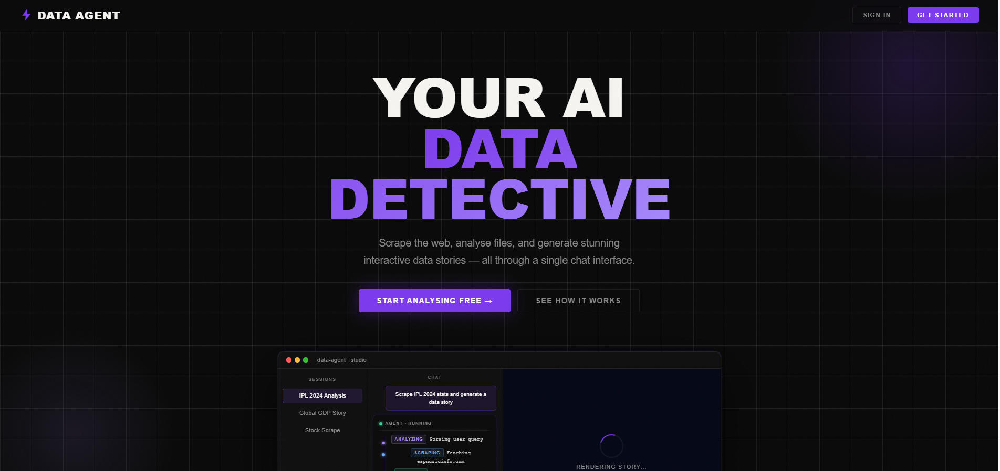
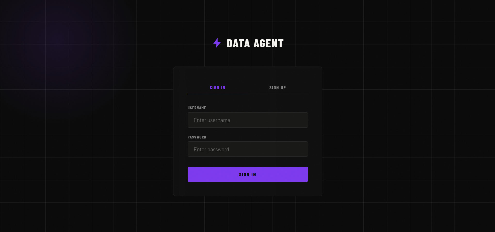
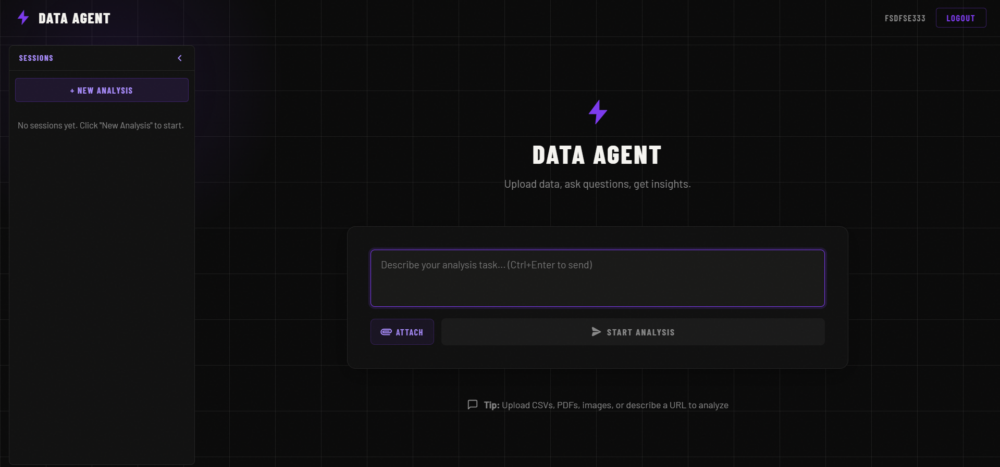
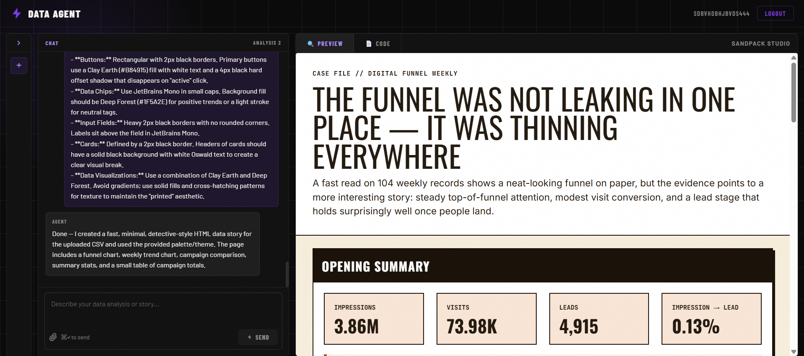

# Data Agent React

A full-stack data agent platform combining a FastAPI backend with a React + Vite frontend. This repo is built to support authenticated chat-based analytics, file uploads, dataset storytelling, and generated artifact delivery.

---

## 🚀 Project Overview

- `backend/`: FastAPI service that handles authentication, chat history, file uploads, and agent orchestration.
- `frontend/`: React application powered by Vite for user login, dashboard, and chat interaction.
- `uploads/`: Storage for per-chat uploaded files and generated artifacts.

---

## 📦 Tech Stack

- Backend: Python, FastAPI, SQLAlchemy, OAuth2 / JWT auth
- Frontend: React, Vite, React Router, Material UI
- Data tools: LangChain, langchain_experimental, OpenAI/AIPIPE-style API access

---

## 🛠️ Setup Instructions

### Backend

1. Open a terminal and navigate to the backend folder:

```powershell
cd backend
```

2. Create and activate a Python virtual environment:

```powershell
python -m venv .venv
.venv\Scripts\Activate.ps1
pip install --upgrade pip
```

3. Install backend dependencies:

```powershell
pip install -r requirements.txt
```

4. Create a `.env` file in `backend/` with your API settings:

```env
AIPIPE_TOKEN=your_aipipe_token_here
OPENAI_BASE_URL=https://your-openai-base-url
```

> NOTE: `backend/.env` is ignored by `.gitignore`.

5. Start the backend server:

```powershell
uvicorn backend.main:app --reload
```

The API will be available at `http://localhost:8000` by default.

### Frontend

1. Open a terminal and navigate to the frontend folder:

```powershell
cd frontend
```

2. Install Node dependencies:

```powershell
npm install
```

3. Run the development app:

```powershell
npm run dev
```

4. Open the local Vite URL shown in the terminal to launch the React UI.

---

## 📁 Project Structure

- `backend/`
  - `auth.py` — JWT authentication and password hashing
  - `database.py` — SQLite engine and session factory
  - `models.py` — SQLAlchemy models for users, chats, and messages
  - `schemas.py` — Pydantic models for request/response validation
  - `main.py` — FastAPI endpoints for auth, chat, upload, and SSE streaming
  - `agent.py` — LangChain agent orchestration logic
- `frontend/`
  - `src/` — React components, pages, context, and styling
  - `package.json` — frontend dependencies and scripts
  - `vite.config.js` — Vite configuration
- `uploads/` — persisted chat upload directories and generated outputs

---

## 📸 Screenshots


### Landing Page


### Login 


### Dashboard and chat UI


### Generated data story or visualization output



---

## 💡 Notes

- Keep secrets out of source control. The repository ignores `.env` files in both root and backend.
- If you add new frontend packages, run `npm install` from `frontend/` again.
- If the backend schema changes, the SQLite database file may need to be recreated.

---

## 🙌 Contributing

Contributions are welcome. For best results, open issues for bug reports or feature requests, and include steps to reproduce.

---

## 📄 License

MIT © Harliv Singh
